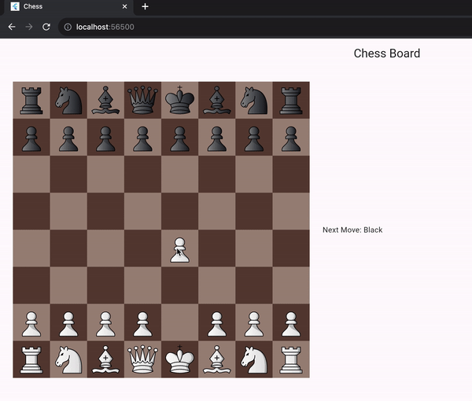

# chess

On-going Chess Game development in Flutter!
Feel free to checkout, fork and send merge requests for collaborations.

Uses chess.dart package to manage game state.

## Getting Started

`flutter run`
